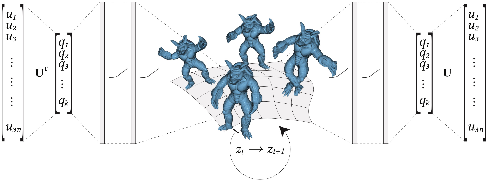

title: Latent-space Dynamics for Reduced Deformable Simulation
author: Lawson Fulton, Vismay Modi, David Duvenaud, David I. W. Levin and Alec Jacobson
html header: <meta property="og:image" content="http://www.dgp.toronto.edu/projects/latent-space-dynamics/latent-space-dynamicsteaser.jpg" />
<meta property="og:description" content="We propose the first reduced model simulation framework for deformable solid dynamics using autoencoder neural networks.We provide a data-driven approach to generating nonlinear reduced spaces for deformation dynamics. In contrast to previous methods using machine learning which accelerate simulation by approximating the time-stepping function, we solve the true equations of motion in the latent-space using a variational formulation of implicit integration. Our approach produces drastically smaller reduced spaces than conventional linear model reduction, improving performance and robustness. Furthermore,our method works well with existing force-approximation cubature methods." />
<meta name="twitter:card" content="summary"></meta>
<meta name="og:title" content="Latent-space Dynamics for Reduced Deformable Simulation"></meta>
css: style.css

# Latent-space Dynamics for Reduced Deformable Simulation _Eurographics 2019_

<div class=authors>

LAWSON FULTON, VISMAY MODI, DAVID DUVENAUD, DAVID I. W. LEVIN, ALEC JACOBSON, University of Toronto

</div>



## Abstract
We propose the first reduced model simulation framework for deformable solid
dynamics using autoencoder neural networks.We provide a data-driven approach to
generating nonlinear reduced spaces for deformation dynamics. In contrast to
previous methods using machine learning which accelerate simulation by
approximating the time-stepping function, we solve the true equations of motion
in the latent-space using a variational formulation of implicit integration. Our
approach produces drastically smaller reduced spaces than conventional linear
model reduction, improving performance and robustness. Furthermore,our method
works well with existing force-approximation cubature methods.

## Downloads

 - [Paper](latent-space-dynamics-for-reduced-deformable-simulation-eurographics-2019-fulton-et-al.pdf)
 - [Paper (low res)](latent-space-dynamics-for-reduced-deformable-simulation-eurographics-2019-compressed-fulton-et-al.pdf)
 - [Video](latent-space-dynamics.mp4)
 - [Slides]()
 - [Code]()

<!-- ## Video -->

<!-- Embed Youtube video here -->

## BibTeX

```
@article{Fulton:LSD:2018,
  title ={Latent-space Dynamics for Reduced Deformable Simulation},
  author = {Lawson Fulton and Vismay Modi and David Duvenaud and David I. W. Levin and Alec Jacobson},
  year = {2019},
  journal = {Computer Graphics Forum}
}
```

## Acknowledgements 

This work is funded in part by NSERC Discovery Grants (RGPIN–2017–05235,
RGPIN-2017-05524, RGPAS–2017–507938, RGPAS-2017-507909), Connaught Funds
(NR2016–17), the Canada Research Chairs Program, the Fields Institute, and gifts
by Adobe Systems Inc, Autodesk Inc, and MESH Inc. We also thank Sarah Kushner
for help with figure creation.
